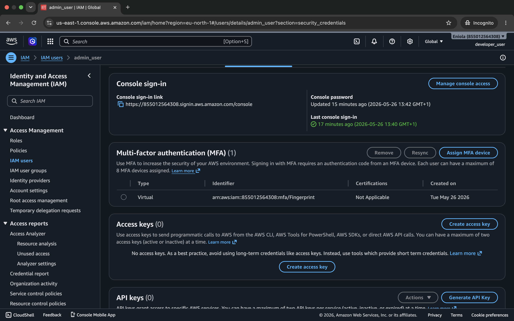
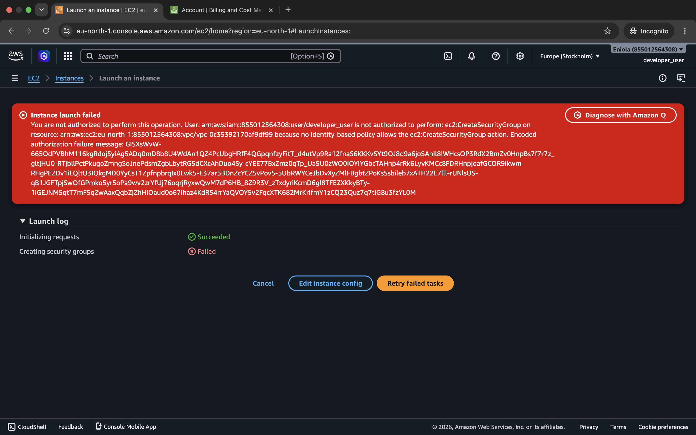

# AWS IAM Users, Groups, and Policies Lab

## Objective
This project demonstrates AWS Identity and Access Management (IAM) by creating users, groups, and policies to control access to AWS resources.

## What I built
- 2 IAM users
- 2 IAM groups
- Applied ReadOnlyAccess and AdministratorAccess policies
- Enabled MFA for security
- Tested permissions using EC2 access

## Key Concepts Learned
- IAM Users and Groups
- AWS Managed Policies
- Least Privilege Principle
- Multi-Factor Authentication (MFA)
- Access control testing

## Results
### IAM Users

### IAM Groups

### MFA Enables

### Permission Denied (Developer User)

