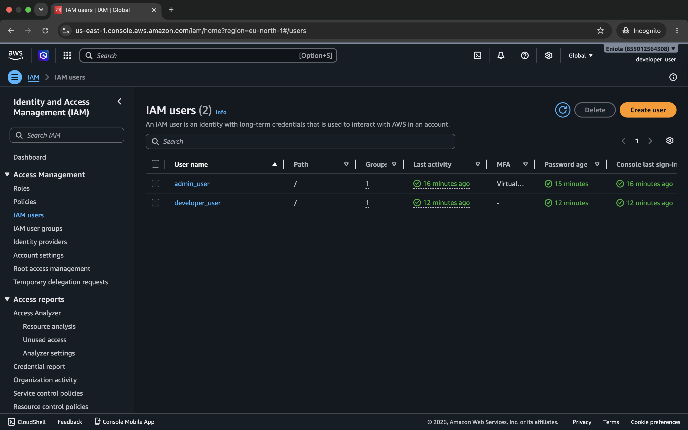

# IAM Users

## Users Created

### 1. developer-user
- Group: Developers
- Permissions: ReadOnlyAccess
- MFA: Not enabled / enabled (state yours)

### 2. admin-user
- Group: Administrators
- Permissions: AdministratorAccess
- MFA: Enabled

## Summary
Two users were created to demonstrate different levels of AWS access control.

## Result
### IAM users

